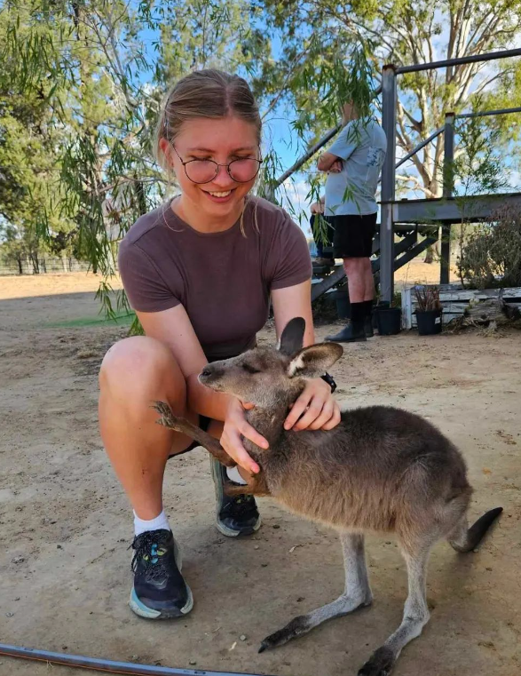

Quantitative ecologist currently undertaking PhD optimising the use of machine learning for animal accelerometer behaviour recognition in small datasets. I like problem solving with data and making complex things simple.

* Skilled in: R, Machine learning, Biologging, Science communication
* Currently learning: Python, MatLab App Builder
* Interested in: Animal behaviour, Evolution of collective (and anti-social) behaviour
* Chat with me about: Hiking, Sustainable fashion, Deep work
* Get in touch: *oakleigh.wilson[at]gmail.com*

  <figure>
    
    <figcaption>Me, with a soon-to-be-collared joey at Roma, outback QLD</figcaption>
  </figure>

