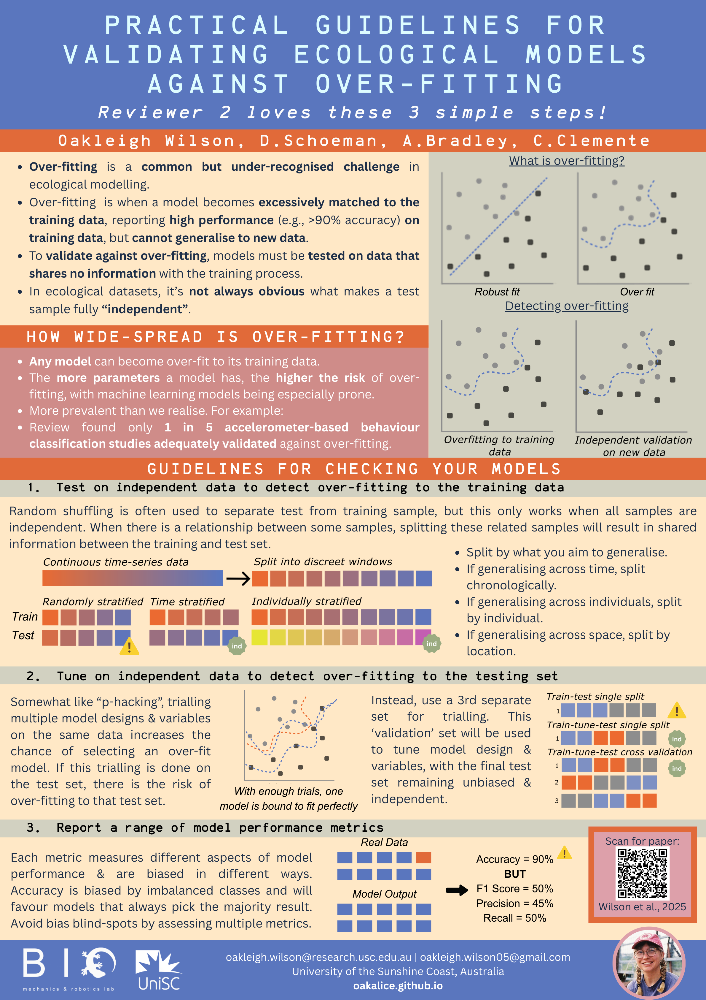
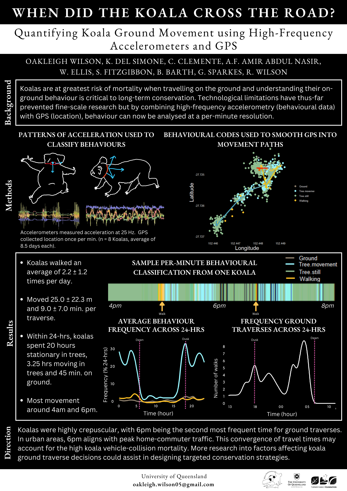

I love science communication and especially spoken presentations. Here I have linked to a small collection of some of the presentations and posters I've had the opportunity to share.

## Sample Presentations

  <iframe 
    src="https://www.youtube.com/embed/hJoAGsBhdO8?si=TdIJK8ke6LXgjuPa" 
    style="width: 70%; height: 400px;" 
    frameborder="0" 
    allowfullscreen>
  </iframe>

  <b>Behaviour is a Sequence, Not a Snapshot</b>: August 15th 2025, Animal Ecology Seminar Series, University of the Sunshine Coast.

  <iframe 
    src="https://www.youtube.com/embed/DrDJ6vk7Ur0" 
    style="width: 70%; height: 400px;" 
    frameborder="0" 
    allowfullscreen>
  </iframe>

  <b>Standarding Machine Learning in Accelerometer-Based Animal Behaviour Classification</b>: August 8th 2024, Thesis Confirmation Seminar, University of the Sunshine Coast.

## Sample Posters

  <figure style="width: 30%;">
    
    <figcaption>Presented at Society of Experimental Biology, 2025</figcaption>
  </figure>
  <figure style="width: 30%;">
    
    <figcaption>Presented at ANZSCPB, 2024</figcaption>
  </figure>
  <figure style="width: 30%;">
    
    <figcaption>Presented at Ecological Society of Australia, 2022</figcaption>
  </figure>

